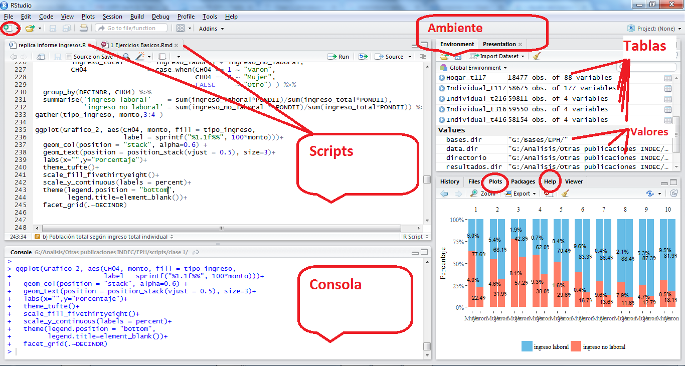

# Descripción del programa        


<br>

## ¿Qué es R?

- Lenguaje para el procesamiento y análisis estadístico de datos

- Software libre y de código abierto

- Sintaxis básica: R base

- Sintaxis incremental[^1]: El lenguaje se va ampliando por aportes de Universidades, investigadores/as, usuarios/as y empresas privadas, organizados en paquetes

<br>


<br>

[^1]: Más allá de los comandos elementales, comandos más sofisticados tienen muchas versiones, y algunas quedan en desuso en el tiempo.


El _entorno_ más cómodo para utilizar el _lenguaje_ __R__ es el _programa_ __R studio__

- Rstudio es una empresa que produce productos asociados al lenguaje R, como el programa sobre el que corremos los comandos, y extensiones del lenguaje (librerías).
 
- El programa es _gratuito_ y se puede bajar de la [página oficial](https://www.rstudio.com/) 




## Diferencias con otros sofwtares

   

Algunas de las características principales de R:       

- Gratuito   
- Funciona principalmente por líneas de código (Aunque ya hay paquetes que permiten ejecutar comandos desde el menú y los botones sin tener que esribir código)
- Trabaja las bases de microdatos de forma virtual y no fisica, lo que permite disponer de varias al mismo tiempo sin mayor dificultad (no requiere abrir cada base, trabajarla por separado y luego cerrarla), ni exije guardar fisicamente los cambios.
- Comunidades-RUGs: Aportes de usuarias y usuarios
- Extensible a otros lenguajes y usos (presentación como esta, diseño de aplicaciones)
- Facilidad para automatizar procesamientos periódicos

<br>

# Lógica sintáctica en R base     

Con _R base_ nos referimos a los comandos básicos que vienen incorporados en el R, sin necesidad de cargar paquetes complementarios. 

## Objetos
Los __Objetos/Elementos__ constituyen la categoría esencial de R. De hecho, todo en R es un objeto, y se almacena con un nombre específico que **no debe poseer espacios**. Un número, un vector, una función, la progresión de letras del abecedario, una base de datos, un gráfico, constituyen para R objetos de distinto tipo. Los objetos que vamos creando a medida que trabajamos pueden visualizarse en la panel derecho superior de la pantalla ("Environment"). 


## Operadores

Los operadores son los símbolos que le indican a R que debe realizar una tarea. Mediante la combinación de datos y operadores es que logramos que R haga su trabajo.

Existen operadores específicos para cada tipo de tarea. Los tipos de operadores principales son los siguientes:

* De asignación
* Aritméticos
* Relacionales
* Lógicos


### Operadores de asignación

- **<-**
- **=**

Ambos operadores sirven para definir objetos, es decir, asignarle un valor. 
Sin embargo, en la práctica se suele utilizar el operador __```<-```__ para la definición de objetos, por más que el __```=```__ sea equivalente.  __A la izquierda__ del __```<-```__ debe ubicarse el nombre que tomará el elemento a crear. __Del lado derecho__ debe ir la definición del mismo.

Veamos un ejemplo:
```{r echo=TRUE}
A <- 1
A 
```

Al definir un elemento, el mismo queda guardado en el ambiente del programa, y podrá ser utilizado posteriormente para observar su contenido o para realizar una operación con el mismo.

```{r echo=TRUE}
A + 6
```

Al correr una linea con el nombre del objeto, la consola del programa nos muestra su contenido. Entre corchetes observamos el número de orden del elemento en cuestión.


```{r echo=TRUE}
B <- 2
B
```

 __```<-```__ y __```=```__ son operadores __Unidireccionales__, es decir que:     
```A <- B``` o  ```A = B```implica que __A__ va tomar como valor el contenido del objeto __B__, y no al revés.

```{r echo=TRUE}
A <- 150
B <- 132
```

```{r echo=TRUE}
A = B #Ahora A toma el valor de B 
print(A)

#(B continua conservando el mismo valor)
```

En R, cuando se define un objeto con el mismo nombre de un objeto previamente existente, el último reemplaza al primero.


### Operadores aritméticos:

- Suma: ```+```
- Resta: ```-```
- Cociente: ```/```
- Multiplicación: ```*```
- Potencia: ```^```

```{r echo=TRUE}
#suma 
5+6

#Resta
6-8

#cociente
6/2

#multiplicacion
6*2

#Potencia
3^3

```

### Operadores lógicos relacionales: 

Los operadores lógicos son usados para describir relaciones, expresadas como verdadero (TRUE) o falso (FALSE).

- Mayor: ```>```
- Mayor o igual: ```>=```
- Menor: ```<```
- Menor o igual: ```<=```
- Igual: ```==```
- Distinto: ```!=```


```{r echo=TRUE}
#Redefinimos los valores A y B
A <- 10
B <- 20

#Realizamos comparaciones lógicas
A > B
A >= B
A < B
A <= B
A == B
A != B

```

Como muestra el siguiente ejemplo, el resultado de una operación lógica puede almacenarse como el valor de un objeto.

```{r}
C <- A != B
C
```


### Otros operadores lógicos: 

- Ó: ```|```
- Y: ```&```

```{r echo=TRUE}
#Redefinimos los valores A y B
A <- 50
B <- 72
#Realizamos comparaciones lógicas

(A > 60 & B > 65)
(A < 60 | B < 65) 

```
> Practica:     
1) Crear un objeto llamado "mi_numero" que almecene un número que ustedes quieran. ¿Qué pasa si lo intentan nombrar como "mi numero"?         
2) Realizar alguna operación matemática con el objeto y guardar el resultado como un nuevo objeto llamado "otro_numero".     
3) Comprobar lógicamente si el segundo objeto es igual a 10.    
4) Comprobar lógicamente si alguno de los dos objetos es mayor a 10     


```{r,eval=FALSE,include=FALSE}
mi_numero <- 9
otro_numero <- mi_numero *2
otro_numero == 10
(otro_numero > 10 | mi_numero > 10) 

```

## Caracteres especiales

- R es sensible a mayúsculas y minúsculas, tanto para los nombres de las variables, como para las funciones y parámetros.
- Los __espacios en blanco__ y los __carriage return__ (_enter_) no son considerados por el lenguaje. Los podemos aprovechar para emprolijar el código y que la lectura sea más simple[^2].

[^2]: veremos que existen ciertas excepciones con algunos paquetes más adelante. 

- El __numeral__ ```#``` se utiliza para hacer comentarios. Todo lo que se escribe después del # no es interpretado por R. Se debe utilizar un # por cada línea de código que se desea anular

- Los __corchetes__ ```[]``` se utilizan para acceder a un objeto:
    - en un vector[n° orden]
    - en una tabla[fila, columna]
    - en una lista[n° elemento]
- el signo __$__ también es un método de acceso. Particularmente, en los dataframes, nos permitira acceder a una determinada columna de una tabla

- Los __paréntesis__```()``` se utilizan en las funciones para definir los parámetros.

- Las __comas__ ```, ```  se utilizan para separar los parametros al interior de una función. 

***

## Tipos de Objetos:    
Existen un gran cantidad de objetos distintos en R, en lo que respecta al curso trabajaremos principalmente con 4 de ellos:

- Valores
- Vectores
- Data Frames
- Listas

### Valores
Nos vamos a referir como "valores" a los objetos de una sola dimensión. Un número, una palabra, una fecha.    

Los valores (y los objetos en general) en R pueden ser de distintas _clases_. Veamos algunos ejemplos:     

__Clase "Numeric" (numéricos)__
```{r echo=TRUE}
A <- 1
class(A)
```

<br>
  
__Clase 'Character' (caracter)__
```{r echo=TRUE}
A <- "Hola, ¿qué tal?"

class(A)
```

<br>

__Clase 'Date' (caracter)__
```{r echo=TRUE}
class(Sys.Date())
```

### Vectores
Un vector es un conjunto de valores de la misma clase. Puede haber vectores númericos, character, Date, etc.

Para crear un __vector__ utilizamos el comando ```c()```, de combinar.
```{r echo=TRUE}
# Vector numérico
vec_num <- c(1, 2, 2,2,3,2,1, 2, 1, 1, 1)
class(vec_num)

# Vector de caracteres
dias_char <- c("Lunes","Viernes","Viernes","Jueves",
       "Martes", "Martes","Miercoles","Martes",
       "Miercoles")
class(dias_char)

# Vector de tipo fecha
vec_fecha <- Sys.Date()+2

class(vec_fecha)

```
La función **table** nos permite hacer un tabulado univariado de la cantidad de casos para cada categoría de un vector (también sirve para tabulados bivariados). Contemos la cantidad de casos por dia de la semana
```{r}
table(dias_char)
```

#### Vectores de tipo 'factor'    
  
En general se usa para datos ordinales. Es decir, para una variable cualitativa para la cual necesitamos establecer cierta ordinalidad en sus posibles valores.      

**Crear o transforma una variable en *factor* nos será sumamente útil para realizar tablas o gráficos siguiendo un orden deseado para las categorías** 

```{r echo=TRUE}
# Una propiedad del factor: las etiquetas.
dias_factor <- factor(dias_char,
                 levels = c("Lunes",
                            "Martes",
                            "Miercoles",
                            "Jueves",
                            "Viernes"))
class(dias_factor)
```
Veamos ahora como se muestra un tabulado con la variable como factor
```{r}
table(dias_factor)
```
La diferencia entre un _character_ y un _factor_ es que el último tiene solo algunos valores permitidos (levels), con un orden interno predefinido.   

Para almacenar como factor una variable, el software está internamente asignando un número a cada categoría. **Tener cuidado si piensan operarluego sobre dicha variable **
```{r}
as.numeric(dias_factor)
```
#### Operaciones con vectores           

Con los vectores numéricos se pueden hacer operaciones como, por ejemplo:
* sumarle 2 a cada elemento del __vector__ anterior.
```{r echo=TRUE}
D <- c(1, 3, 4)
D <- D + 2
D
```

* sumarle 1 al primer elemento, 2 al segundo, y 3 al tercer elemento del __vector__ anterior
```{r echo=TRUE}
E <- D + 1:3 #esto es equivalente a hacer 3+1, 5+2, 6+9 
E
```
```1:3``` significa que queremos todos los números enteros desde 1 hasta 3. 

#### Métodos de acceso      

Para trabajar con ciertos valores de un vector (u otro objeto de más de una dimensión) existen los denominados *métodos de acceso*. 
Para acceder a un valor de cierto vector utilizamos los signos ```[ ]``` y podemos buscarlo/s a través del número de orden

```{r echo=TRUE}
# Si quiero al valor 2 del objeto E:
E 
E[2]
```

Si nos interesa quedarnos con dicho valor, al buscarlo lo asignamos a un nuevo objeto.
```{r echo=TRUE}
E_posicion2 <-  E[2]
E_posicion2
```

Para __borrar__ un objeto del ambiente de trabajo, utilizamos la función _```rm()```_
```{r error=TRUE}
rm(E_posicion2)
E_posicion2
```

También podemos cambiar el texto del segundo elemento de E, por el texto "Pablo"
```{r echo=TRUE}
E
E[2] <- "Pablo"
E

# Tener cuidado al modificar el tipo de uno de los valores y no el de todos los del objeto:
class(E)
```

> Practica:     
1) Crear un vector numerico de 7 valores, elegir numeros entre 1 y 50        
2) Comprobar logicamente cuales de ellos son menores a 25    
3) Extraer del vector el 3er y 5to valor      
4) Extraer del vector todos los valores menores a 25      


```{r,eval=F,include=F}
vec_practica <- c(4,53,5,1,7,30,21)
vec_practica < 25
vec_practica[c(3,5)]
vec_practica[vec_practica < 25]

```


### Data Frames
Un Data Frame es una estructura de datos de 2 dimensiones o tabla, donde cada columna representa una variable, y cada fila una observación. 
Los data frames pueden contener datos de diferentes clases. 
Puede ser considerado como un conjunto de vectores de igual tamaño, donde cada vector (columna) tiene que tener datos del mismo tipo, pero las clases de vectores que conforman la tabla pueden ser distintas. Entonces, cada observación (fila) está compuesta por datos que pueden ser de distinto tipo.

Este objeto es central en el proceso de trabajo, ya que es la estructura más usada para realizar análisis de datos, y suele ser la forma en que se cargan datos externos para trabajar en el ambiente de R, y en que se exportan los resultados de nuestros trabajo.  

Veamos un ejemplo de data frame creado a partir de la combinación de vectores:
```{r echo=TRUE}
AGLOMERADO  <- c(32,33,33,33,32)

SEXO  <-  c("Varon","Mujer","Mujer","Varon","Mujer")

EDAD  <-  c(60,54,18,27,32)

Datos <- data.frame(AGLOMERADO, SEXO, EDAD)
Datos
class(Datos)
```

Tal como en un __vector__ podemos acceder a los elementos a través de los ```[ ]```, en un __dataframe__ lo hacemos de la forma __```[fila, columna]```__.

En los Data.Frames tenemos, por definición, más de una columna (variable). Para acceder a alguna de ellas podemos utilizar el operador __```$```__.
```{r}
Datos[3,2]
Datos[4,3]

Datos$AGLOMERADO
class(Datos$AGLOMERADO)

Datos$AGLOMERADO[2]
```

¿que pasa si hacemos ```Datos$AGLOMERADO[3,2]``` ?
```{r error=TRUE}
Datos$AGLOMERADO[3,2]
```

Nótese que el último comando tiene un número incorrecto de dimensiones, porque estamos refiriendonos 2 veces a la columna AGLOMERADO.    

Acorde a lo visto anteriormente, el acceso a los __dataframes__ mediante  ```[ ]``` puede utilizarse también para realizar filtros (devolver el o los valores en función de otro valor definido). 
Por ejemplo, puedo utilizar los  ```[ ]``` para obtener del __dataframe__ ```Datos ```  unicamente los registros del AGLOMERADO 32:
```{r error=TRUE}
Datos[Datos$AGLOMERADO==32, ]
```

La lógica del paso anterior sería: Accedo al dataframe ```Datos```, pidiendo únicamente conservar las filas (por eso la condición se ubica a la _izquierda_ de la  ```, ```) que cumplan el requisito de pertenecer a la categoría __32__ de la variable __AGLOMERADO__.      

Aún más, podría aplicar el filtro (reduzco filas) y al mismo tiempo seleccionar una variable de interés (columna). Ello me permitiría  luego realizar un cálculo sobre el vector resultante. Por ejemplo, podría calcular la media de la edad en aquellas personas que residen en el aglomerado 32.
```{r error=TRUE}
Edad_Aglo32 <- Datos[Datos$AGLOMERADO==32,"EDAD"]
Edad_Aglo32

## Otra forma de llegar a lo mismo
Datos$EDAD[Datos$AGLOMERADO==32]
```

```{r error=TRUE}
mean(Edad_Aglo32)
```
<br>

### Listas

Contienen una concatenación de objetos de cualquier tipo. Así como un vector contiene valores, un dataframe contiene vectores, una lista puede contener dataframes, pero también vectores, o valores, y _todo ello a la vez_
```{r}
LISTA <- list(A,B,C,D,E,Datos$AGLOMERADO, DF = Datos)
LISTA
```

Tal como para con los Vectores y los Data.Frames, podemos acceder a un elemento de una lista, utilizando el operador __```$```__:
```{r}
LISTA$DF
LISTA$DF$EDAD
LISTA$DF$EDAD[2]
```

También se pueden usar corchetes dobles __```[[]]```__ para acceder a los distintos elementos de una lista.
```{r}
LISTA[[6]]
```

O para acceder a un valor/vector (dependiendo del tipo de elemento de la lista) de un objeto de la lista:
```{r}
LISTA[[6]][1]

LISTA[[7]][2]

LISTA[[7]][2,1]
```

## Funciones:
Las funciones son series de procedimientos estandarizados, que toman como input determinados argumentos a fijar por el usuario (llamados parámetros), y devuelven un resultado acorde a la aplicación de dichos procedimientos. Su lógica de funcionamiento es:   
```funcion(argumento1 = arg1, argumento2 = arg2)```      

A lo largo del curso iremos viendo numerosas funciones, según lo requieran los distintos ejercicios. Sin embargo, veamos ahora algunos ejemplos para comprender su funcionamiento:    

- paste() : concatena una serie de caracteres, indicando por última instancia como separar a cada uno de ellos        
- paste0(): concatena una serie de caracteres sin separar
- sum(): suma de todos los elementos de un vector   
- mean() promedio aritmético de todos los elementos de un vector   
```{r}
paste("Pega","estas", 4, "palabras", sep = " ")

#Puedo concatenar caracteres almacenados en objetos
a <- c(1, 2, 3)
b <- "con"
c <- c(4, 5, 6)

paste(a,b,c,sep = "-")

# Paste0 pega los caracteres sin separador
paste0(a,b,c)

# Repasando un comando ya visto...
1:5

# Función para sumar
sum(1:5)

# Para calclar medias
mean(1:5)

#Maximo
max(Datos$EDAD)

#Valores únicos de un vector
unique(Datos$AGLOMERADO)

```
> Practica: Abrir la pequeña base contenida en el archivo "comunas.xlsx". Luego:            
1) Calcular el area promedio de las comunas               
2) Calcular el area total de la Ciudad de Buenos Aires     
3) Crear un nuevo dataframe que contenga solo las columnas AREA y COMUNA     
4) Crear un nuevo dataframe que contenga todas las columnas, pero solo las filas donde el area sea mayor a 15 millones.      

```{r,eval=F,include=F}
comunas <- read_excel("bases/comunas.xlsx")
mean(comunas$AREA)
sum(comunas$AREA)
area_comunas_df<- comunas[,c("AREA","COMUNAS")]
grandes_df<- comunas[comunas$AREA > 15000000,]

```


# Instalación de paquetes complementarios al R Base

Hasta aquí hemos visto múltiples funciones que están contenidas dentro del lenguaje básico de R. Ahora bien, al tratarse de un software libre, distintos usuarios de R contribuyen sistemáticamente a expandir este lenguaje mediante la creación y actualización de __paquetes__ complementarios. Lógicamente, los mismos no están incluidos en la instalación inicial del programa, pero podemos descargarlos e instalarlos con el siguiente comando:   
``` 
install.packages("nombre_del_paquete") 
```
Al ejecutar el comando se descargarán de la pagina de [CRAN](www.cran.r-project.org) los archivos correspondientes al paquete hacia el directorio en donde hayamos instalado el programa. Típicamente los archivos se encontrarán en **C:\Program Files\R\R-4.0.4\library\**, siempre con la versión del programa correspondiente.              

Los paquetes sólo se instalan una vez en la computadora (si cambias de computadora, tenés que volver a instalarlo). Una vez instalado el paquete, cada vez que abramos una nueva sesión de R y querramos utilizar el mismo debemos **cargarlo al ambiente de trabajo** mediante la siguiente función:
``` 
library(nombre_del_paquete)
```
Nótese que al cargar/activar el paquete no son necesarias las comillas.

