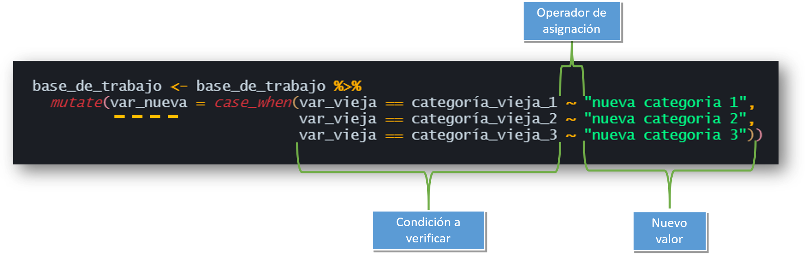
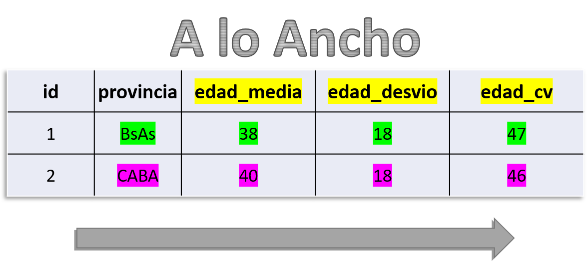
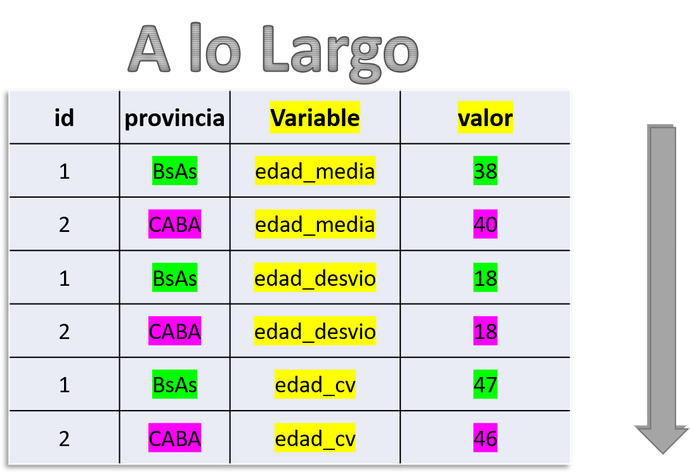

<style type="text/css">

.remark-slide-content {
    font-size: 25px;
    padding: 1em 1em 1em 1em;
}

```{css, eval = TRUE, echo = FALSE}

.remark-code{
  line-height: 1.5; font-size: 80%
}

@media print {
  .has-continuation {
    display: block;
  }
}
```


```{r xaringan-scribble, echo=FALSE}
##~~~~~~~~~~~~~~~~~~~~~~~~~~~~~~~~~~~~~~~~~~~~~~~~~~~~~~~~~~~~~~~~~~~~~~~~~~~~~~
##                                  PIZARRA                                 ----
##~~~~~~~~~~~~~~~~~~~~~~~~~~~~~~~~~~~~~~~~~~~~~~~~~~~~~~~~~~~~~~~~~~~~~~~~~~~~~~
xaringanExtra::use_scribble()
```


```{r xaringanExtra-clipboard, echo=FALSE}
##~~~~~~~~~~~~~~~~~~~~~~~~~~~~~~~~~~~~~~~~~~~~~~~~~~~~~~~~~~~~~~~~~~~~~~~~~~~~~~
##                                  cLIPBOARD                               ----
##~~~~~~~~~~~~~~~~~~~~~~~~~~~~~~~~~~~~~~~~~~~~~~~~~~~~~~~~~~~~~~~~~~~~~~~~~~~~~~
htmltools::tagList(
  xaringanExtra::use_clipboard(
    button_text = "<i class=\"fa fa-Copiar código\"></i>",
    success_text = "<i class=\"fa fa-check\" style=\"color: #90BE6D\"></i>",
    error_text = "<i class=\"fa fa-times-circle\" style=\"color: #F94144\"></i>"
  ),
  rmarkdown::html_dependency_font_awesome()
)
```


```{r xaringan-fit-screen, echo=FALSE}
##~~~~~~~~~~~~~~~~~~~~~~~~~~~~~~~~~~~~~~~~~~~~~~~~~~~~~~~~~~~~~~~~~~~~~~~~~~~~~~
##                          PRESENTACION VS RSTUDIO                         ----
##~~~~~~~~~~~~~~~~~~~~~~~~~~~~~~~~~~~~~~~~~~~~~~~~~~~~~~~~~~~~~~~~~~~~~~~~~~~~~~
xaringanExtra::use_fit_screen()
```


```{r xaringan-extra-styles, echo = FALSE}
##~~~~~~~~~~~~~~~~~~~~~~~~~~~~~~~~~~~~~~~~~~~~~~~~~~~~~~~~~~~~~~~~~~~~~~~~~~~~~~
##                          ESTILOS EXTRA -RESALTADO-                       ----
##~~~~~~~~~~~~~~~~~~~~~~~~~~~~~~~~~~~~~~~~~~~~~~~~~~~~~~~~~~~~~~~~~~~~~~~~~~~~~~
xaringanExtra::use_extra_styles(
  hover_code_line = TRUE,         #<<
  mute_unhighlighted_code = TRUE  #<<
)
```


```{r include = FALSE}
##~~~~~~~~~~~~~~~~~~~~~~~~~~~~~~~~~~~~~~~~~~~~~~~~~~~~~~~~~~~~~~~~~~~~~~~~~~~~~~
##                              Cargo librerías                             ----
##~~~~~~~~~~~~~~~~~~~~~~~~~~~~~~~~~~~~~~~~~~~~~~~~~~~~~~~~~~~~~~~~~~~~~~~~~~~~~~
library(flipbookr)
library(tidyverse)
library(xaringanthemer)
library(xaringan)
library(gt)
library(icons)
library(here)
library(gt)
#remotes::install_github("mitchelloharawild/icons")

options(scipen = 999)

##~~~~~~~~~~~~~~~~~~~~~~~~~~~~~~~~~~
##  ~ Cargo la base de trabajo  ----
##~~~~~~~~~~~~~~~~~~~x~~~~~~~~~~~~~~~

eph_3t2022 <- eph::get_microdata(year = 2022, 
                            trimester = 3,type='individual')
```

---
class: inverse, center, middle


# Paquetes

<html>
  <div style='float:left'></div>
  <hr color='#EB811B' size=1px width=1125px>
</html>
 

---

# Paquetes  

## ¿Qué son?

--

✔️ Los paquetes son, principalmente, funciones que no están en r base, pero también bases de datos y objetos de R en general.

--

## ¿Para qué nos sirven?   

✔️ Ayudan a resolver problemas que con r base no se podía, o que era muy difícil hacerlo.
 

---
class: middle, center, inverse

background-image: url(img/R1.PNG)
background-size: contain

---
class: middle, center, inverse

background-image: url(img/R2.PNG)
background-size: contain

---
class: middle, center, inverse

background-image: url(img/R3.PNG)
background-size: contain

---
class: middle, center, inverse

background-image: url(img/R4.PNG)
background-size: contain

---
class: middle, center, inverse

background-image: url(img/R5.PNG)
background-size: contain
  
---

#Paquetes    

## INSTALACIÓN

- Podemos descargarlos e instalarlos con el siguiente comando: 

```r
install.packages("nombre_del_paquete") 
```

- Sólo es necesario instalar el paquete una vez por computadora.

---

#Paquetes  

## INVOCACIÓN

.pull-left[

- Una vez instalado, cada vez que abramos una nueva sesión de R y querramos utilizar el paquete debemos **cargarlo al ambiente de trabajo** mediante la función:    

```r
library(nombre_del_paquete)
```
]

.pull-right[

```{r echo=FALSE, eval=TRUE, out.width= '500px'}


```
]


---

class: inverse, middle, center

<html>
  <div style='float:left'></div>
  <hr color='#EB811B' size=1px width=1125px>
</html>

# [Tidyverse](https://www.tidyverse.org/)


---
# Tidyverse

.pull-left[
#### `Tidyverse` es una colección de paquetes de R, pensados para trabajar en "ciencia de datos". 
 
]

.pull-right[


```{r echo=FALSE, fig.align = 'center'}
knitr::include_graphics("img/tidyverse.png")
```
]

---
class: inverse, middle, center


# ¿Por qué tidyverse?


<html>
  <div style='float:left'></div>
  <hr color='#EB811B' size=1px width=1125px>
</html>


 
---
# __¿Por qué tidyverse?__


- ### Orientado a ser leído y escrito por y para seres humanos


--


- ### Funciones no pensadas para una tarea específica sino para un proceso de trabajo

.pull-left[
```{r echo=FALSE, fig.align = 'center', out.width='100%'}
knitr::include_graphics("img/circuito_del_dato.png")
```
]

--

.pull-right[
```{r echo=FALSE, fig.align = 'center', out.width='100%'}
knitr::include_graphics("img/circuito_del_dato_tidy.png")
```
]

--


- ### Su comunidad, basada en los principios del código abierto y trabajo colaborativo 


---
# __Instalación y uso__

* Sólo una vez (por computadora):
```r
install.packages("tidyverse")
```

--

* En cada inicio de sesión de R o Rstudio:

```r
library(tidyverse)
```
 
--

.pull-left[

_No es necesario esto:_

```r
install.packages("dplyr")
install.packages("tidyr")
install.packages("ggplot2")
```
]

.pull-right[

_Ni esto:_

```r
library(dplyr)
library(tidyr)
library(ggplot2)
```
]


---
# Hoja de ruta

### Presentación de los paquetes `dplyr` y `tidyr` 


.pull-left[

## ✔️ lectura / escritura

_{readr}_:

☑️ `read_csv()` ☑️ `read_table()`

_{haven}_:

☑️ `read_sav()` ☑️ `read_dat()`

☑️ `read_sas()` 

## ✔️ magrittr

☑️ `%>%`


## ✔️ tidyr
    
☑️ `pivot_longer()` ☑️ `pivot_wider()` 

]


.pull-right[

## ✔️ dplyr

☑️️ `select()`   ☑️️ `filter()`

☑️️ `mutate()`   ☑️️ `rename()`

☑️️ `arragne()`  ☑️️ `summarise()`

☑️️ `group_by()`

]


---
class: middle, center, inverse


# Lectura / escritura de archivos

<html>
  <div style='float:left'></div>
  <hr color='#EB811B' size=1px width=1125px>
</html>

 
---
# Lectura / escritura de archivos

## Hay varios paquetes que ayudan a la lectura de archivos, los principales son:


.pull-left[

### Paquete `{readr}`

- `read_csv()`   --> *.csv*

- `read_table()` --> *.txt*

- `read_rds()`   --> *.rds*
]

.pull-right[

### Paquete `{haven}`

- `read_sav()` --> SPSS

- `read_dta()` --> STATA

- `read_sas()` --> SAS

]

 

---
# Base de trabajo

- **Base de trabajo: ** Encuesta Permanente de Hogares

- [Acceso a bases desde INDEC](https://www.indec.gob.ar/indec/web/Institucional-Indec-BasesDeDatos)

- [Paquete `{eph}`](https://holatam.github.io/eph/)


--

Con la siguiente sentencia puedo importarla a R:

```r
eph_3t2022 <- read.delim("bases/EPH_usu_3er_Trim_2022_txt/usu_individual_T322.txt.txt", 
                             header = TRUE, 
                             sep = ";", 
                             dec = ",")
```

---
class: middle, center, inverse
  
  EL PIPE

```{r echo=FALSE, out.width = '20%', fig.align = 'center'}

```

_<p style="color:grey;" align:"center">Una forma de escribir</p>_

---
# magrittr

.pull-left[

### **Sin EL PIPE:**

```{r eval=F}
### Calculo la media
round(prop.table(table(`eph_3t2022$ESTADO`)), digits = 2)
```

]

--

.pull-right[

### **Con EL PIPE**


```{r eval = F}

### Cargo la librería
library(tidyverse)

### Calculo la media
`eph_3t2022$ESTADO` %>% 
  table() %>% 
  prop.table() %>% 
  round(digits = 2)
```

]


---
class: middle, center, inverse
  

```{r echo=FALSE, out.width = '30%', fig.align = 'center'}
knitr::include_graphics("img/logo dplyr.png")
```

---
# dplyr

## Funciones del paquete dplyr:

<br>

| __Función__   | __Acción__ |
| :---          | ---:   |
| `select()`    | *selecciona o descarta variables*|
| `filter()`    | *selecciona filas*|
| `mutate()`    | *crea / edita variables*|
| `rename()`    | *renombra variables*|
| `group_by()`  | *segmenta en funcion de una variable*|
| `summarize()` | *genera una tabla de resúmen*|

---


class: inverse, middle, center

# __select()__
 
<html>
  <div style='float:left'></div>
  <hr color='#EB811B' size=1px width=1125px>
</html>

_<p style="color:grey;" align:"center">Elije o descarta columnas de una base de datos</p>_
 

---
# select()


### La función tiene el siguiente esquema:

```r
base_de_datos %>% 
  select(variable_1, variable_2, variable_n)
```


---
# select()

### Supongamos que quiero trabajar con las variables para medir la **condicion de actividad** por **sexo** y **edad**


---
# select() - por nombre de variable


### selecciono las columnas que deseo de la base de datos:

```r
b_eph_seleccion <- `eph_3t2022` %>% 
  select(ESTADO, CH04, CH06)
```

```{r echo = FALSE}
b_eph_seleccion <- eph_3t2022 %>% 
  select(ESTADO, CH04, CH06)
```

--

### Chequeo la operación:

```{r}
colnames(b_eph_seleccion)
```
 

---
# select() - por posición de la columna


### Supongamos que quiero las columnas __"CODUSU"__, __"TRIMESTRE"__ y __"PONDERA"__ 

--

1) Chequeo la posición de las columnas que deseo:

```{r}
colnames(eph_3t2022)
```


---
# select() - por posición de la columna

2) Aplico la función `select()` en base a la posición de las columnas:


```r
b_eph_seleccion2 <- eph_3t2022 %>% 
  select(1, 3, 10)
```

```{r echo = FALSE}
b_eph_seleccion2 <- eph_3t2022 %>% 
  select(1, 3, 10)
```

--

### chequeo seleccion:

```{r}
colnames(b_eph_seleccion2)
```


---

```{r select_1, include=FALSE}
eph_3t2022 %>% 
  select(8:10) %>%
  print()
```

`r chunk_reveal("select_1", widths = c(1.1, 1.9), title = "# Otra forma de selecionar")`

---
class: inverse, middle, center

## Una más!

---


```{r select_2, eval = F, echo = F}
eph_3t2022 %>%
  select(ANO4:COMPONENTE) %>%
  print()
```

`r chunk_reveal("select_2", widths = c(1.3, 1.7), title = "# Otra forma de selecionar")`

---
class: inverse, middle, center

## Una más!

---


`r chunk_reveal("select_3", widths = c(1.3, 1.7), title = "# Otra forma de selecionar")`

```{r select_3, eval = F, echo = F}
eph_3t2022 %>%
  select(starts_with("POND")) %>%
  print()
```

---
class: inverse, middle, center

## Una más!

---


`r chunk_reveal("select_4", widths = c(1.3, 1.7), title = "# Otra forma de selecionar")`


```{r select_4, eval = F, echo = F}
eph_3t2022 %>%
  select(ends_with("_M")) %>%
  print()
```

---
class: inverse, middle, center

## Una más!

---


`r chunk_reveal("select_5", widths = c(1.3, 1.7), title = "# Otra forma de selecionar")`


```{r select_5, eval = F, echo = F}
eph_3t2022 %>%
  select(contains("02")) %>%
  print()
```


---
class: inverse, middle, center


# _PRÁCTICA_


<html>
  <div style='float:left'></div>
  <hr color='#EB811B' size=1px width=1125px>
</html>
 

---
class: inverse, middle

## Práctica

1) Crear un objeto en donde importamos la base de datos de la EPH (recordar tener en cuenta la extensión del archivo)

2) Crear otro objeto en donde selecciono 3 columnas de interés según sus nombres

3) Crear otro objeto en donde selecciono 3 columnas de interés según su posición

4) Escribir el siguiente código en el esquema "paso a paso (con pipes)"

```{r eval=F}
base_ejercicio <- select(eph_3t2022, ESTADO, CH04, CAT_OCUP)
```


---
class: inverse, middle, center

# filter()

<html>
  <div style='float:left'></div>
  <hr color='#EB811B' size=1px width=1125px>
</html>

_<p style="color:grey;" align:"center">Define los casos (filas) en base a una condición</p>_
 

---
# filter()


### La función tiene el siguiente esquema:

```r
base_de_datos %>% 
  filter(variable_x >= categoria)
```

--


### **Caso:** Supongamos que deseo quedarme sólo con la población de 14 o más años de edad


---


`r chunk_reveal("filter", widths = c(1.3, 1.7), title = "# filter()")`


```{r filter, eval = F, echo = F}
eph_3t2022 %>% 
  filter(CH04 >= 14) %>% #BREAK
  print()
```


---
# filter() - chequeo

- Chequeamos la operacion

```{r}
b_eph_filtro1 <- eph_3t2022 %>% 
  filter(CH06 >= 14)
```

```{r}
summary(b_eph_filtro1$CH06)
```


---
# filter()

#### Operadores para filtrar:

<br>

.pull-left[

|Condición |Acción              |
| :---     | :---               |
|          |                    |
| `==`     | *igual*            |
| `%in%`   | *incluye*          |
| `!=`     | *distinto*         |
| `>`      | *mayor que*        |
| `<`      | *menor que*        |
| `>=`     | *mayor o igual que*|
| `<=`     | *menor o igual que*|

]

.pull-right[

| Operador | Descripción |
| :---     | :---               |
|          |                    |
| `&`      | *y* - Cuando se cumplen ambas condiciones   |
| &#124;   | *o* - Cuando se cumple una u otra condición   |


]

---
# filter()

### **Caso:** Necesito delimitar el universo a la población que reside en la _Ciudad Autónoma de buenos Aires_ __o__ en los _Partidos del Buenos aires_.

--


- Chequeo categorías de la variable:

```{r}
unique(eph_3t2022$AGLOMERADO)
```

--

- Reviso en el diseño de registro los códigos correspondientes.

---

`r chunk_reveal("filter_0", widths = c(1.7, 1.3), title="# filter")`

```{r filter_0, eval = F, echo = F}
eph_3t2022 %>% 
  select(AGLOMERADO, CH04, CH06, ESTADO, PONDERA) %>% #BREAK
  filter(AGLOMERADO == 32 | AGLOMERADO == 33) %>%
  print()
```


---

`r chunk_reveal("filter_2", widths = c(1.7, 1.3), title="# filter")`

```{r filter_2, eval = F, echo = F}
eph_3t2022 %>% 
  select(AGLOMERADO, CH04, CH06, ESTADO, PONDERA) %>% #BREAK
  filter(AGLOMERADO %in% c(32,33)) %>%
  print()
```


---
class: inverse, middle, center

# _PRÁCTICA GRUPAL_

<html>
  <div style='float:left'></div>
  <hr color='#EB811B' size=1px width=1125px>
</html>


---
class: inverse, middle

# Práctica Grupal

- A partir de la base de la EPH, crear un objeto nuevo que **contenga** las variables __AGLOMERADO__ y __CH06__ y **filtar** por aquella población que tenga _18 o más años de edad_ y que resida en los aglomerados de _Neuquén_ o _Río Negro_

- Chequear que las operaciones hayan sido un éxito (_pista: funciones como **unique()**, **table()** o **colnames()** pueden ser de ayuda)_


---
class: inverse, middle, center

# _mutate()_

<html>
  <div style='float:left'></div>
  <hr color='#EB811B' size=1px width=1125px>
</html>

_<p style="color:grey;" align:"center">Creoa / edita variables (columnas)</p>_

---
# mutate()

### La función tiene el siguiente esquema:

```r
base_de_datos %>% 
   mutate(var_nueva = var_1 + var_2)
```


### **Caso:** Supongamos que quiero crear la variable `direccion`, uniendo la información de la `calle` y el  `numero`:

<br><br>


---
# mutate()

<br><br>

### **Indicador:** Sumatoria de ingresos por la ocupación principal y secundaria(s)

<br><br>


---

`r chunk_reveal("mutate_1", widths = c(1.7, 1.3), title="# mutate()")`

```{r mutate_1, eval = F, echo = F}
eph_3t2022 %>% 
  select(P21, TOT_P12) %>% #BREAK
  mutate(ingreso_ocup_tot = P21 + TOT_P12)
```


---
# mutate() - case_when()

### Función complementaria: `case_when()`, mayormente utilizada para recodificación de variables

```{r echo=FALSE, fig.align = 'center', out.width='100%'}

```


---


```{r mutate_2, eval = F, echo = F}
eph_3t2022 %>%
  select(CH04, CH06) %>% #BREAK
  mutate(sexo = case_when(CH04 == 1 ~ "Varón",
                          CH04 == 2 ~ "Mujer"))
```

`r chunk_reveal("mutate_2", widths = c(1.7, 1.3), title = "# Recodificando con mutate() y case_when()")`


---


```{r mutate_3, eval = F, echo = F}
eph_3t2022 %>%
  select(CH06) %>% #BREAK
  mutate(edad_rango = case_when(CH06 %in% c(0:18) ~  "0 a 18",
                                CH06 %in% c(19:29) ~ "19 a 29",
                                CH06 %in% c(30:39) ~ "30 a 39",
                                CH06 %in% c(40:49) ~ "40 a 49",
                                CH06 %in% c(50:59) ~ "50 a 59",
                                CH06 >= 60 ~ "60 o más"))
```

`r chunk_reveal("mutate_3", widths = c(1.7, 1.3), title = "# Recodificando con mutate() y case_when()")`


---
class: inverse, middle, center

# _PRÁCTICA GRUPAL_

***

---
class: inverse


# Práctica Grupal


1) Crear una variable nueva con las etiquetas correspondientes a los valores de **CAT_OCUP**:

```r
1 --> Patrón
2 --> Cuenta propia
3 --> Obrero o empleado
4 --> Trabajador familiar sin remuneración
9 --> Ns./Nr.
```

1) Recodificar la variable de ingresos P21 en 5 rangos.


---
class: inverse, middle, center

# _summarise()_

<html>
  <div style='float:left'></div>
  <hr color='#EB811B' size=1px width=1125px>
</html>

_<p style="color:grey;" align:"center">Resume la información en una nueva tabla</p>_

---
# summarise()

<br><br>
<br><br>

#### **Caso:**


- **Indicador1:** Quiero conocer cuántas personas ocupadas hay

- **Indicador2:** Quiero conocer el ingreso medio de la ocupación principal


---


```{r summarise_1, eval = F, echo = F}
eph_3t2022 %>%
  select(ESTADO, P21, PONDERA) %>% #BREAK
  summarise(cant_pob_tot = sum(PONDERA),
            cant_ocupados = sum(PONDERA[ESTADO == 1]), 
            min_ingr_oc_princ = min(P21),
            max_ingr_oc_princ = max(P21),
            ingr_oc_princ_media = questionr::wtd.mean(x = P21, 
                                                      weights = PONDERA))
```

`r chunk_reveal("summarise_1", widths = c(1.7, 1.3), title = "# _summarise()_")`


---


```{r summarise_2, eval = F, echo = F}
library(questionr)

eph_3t2022 %>%
  select(ESTADO, P21, PONDERA) %>% #BREAK
  summarise(cant_pob_tot = sum(PONDERA),
            cant_ocupados = sum(PONDERA[ESTADO == 1]), 
            min_ingr_oc_princ = min(P21),
            max_ingr_oc_princ = max(P21),
            ingr_oc_princ_media = wtd.mean(x = P21, # Paquete questionr
                                           weights = PONDERA))
```

`r chunk_reveal("summarise_2", widths = c(1.7, 1.3), title = "# _summarise()_")`


---
class: inverse, middle, center

# _group_by()_

***

_<p style="color:grey;" align:"center">Aplica una operación sobre la población de forma segmentada</p>_


---
# group_by()

<br><br>
<br><br>

```r
base_de_datos %>% 
        group_by(variable_de_corte) #<<
```

---


```{r group_by_1, eval = F, echo = F}
library(questionr)

eph_3t2022 %>%
  group_by(CH04) %>% 
  summarise(cant_pob_tot = sum(PONDERA),
            cant_ocupados = sum(PONDERA[ESTADO == 1]), 
            min_ingr_oc_princ = min(P21),
            max_ingr_oc_princ = max(P21),
            ingr_oc_princ_media = wtd.mean(x = P21, # Paquete questionr
                                           weights = PONDERA))
```

`r chunk_reveal("group_by_1", widths = c(1.3, 1.7), title = "# _group_by()_")`

---
# Paso a Paso


```{r echo=FALSE, out.width = '60%', fig.align = 'center'}
knitr::include_graphics("https://media.tenor.com/images/6c8cf7404cd3fdc8f518221899116825/tenor.gif")
```

---
# **Caso**

### - **Indicador 1:** *Principales tasas del mercado de trabajo para el aglomerado de CABA y Partidos del GBA*

### - **Indicador 2:** *Indicador 1 según el __sexo__ y __edad__ de las personas.*

--

Según el [Diseño de registro](https://www.indec.gob.ar/ftp/cuadros/menusuperior/eph/EPH_registro_t318.pdf), las variables de trabajo son:

- **Aglomerado de residencia** = `AGLOMERADO`

- **Condición de actividad** = `ESTADO`

- **Sexo** = `CH04`

- **Edad** = `CH06`

- **Factor de ponderación** = `PONDERA`

---
```{r group_by_2, eval = F, echo = F}
eph_3t2022 %>% #BREAK
  select(AGLOMERADO, CH04, CH06, ESTADO, P21, PONDERA) %>% #BREAK
  mutate(edad_rango = case_when(CH06 %in% c(0:18) ~  "0 a 18",
                                CH06 %in% c(19:29) ~ "19 a 29",
                                CH06 %in% c(30:39) ~ "30 a 39",
                                CH06 %in% c(40:49) ~ "40 a 49",
                                CH06 %in% c(50:59) ~ "50 a 59",
                                CH06 >= 60 ~ "60 o más"),
         sexo = case_when(CH04 == 1 ~ "Varón",
                          CH04 == 2 ~ "Mujer")) %>% #BREAK
  filter(AGLOMERADO %in% c(32, 33)) %>% 
  group_by(sexo, edad_rango) %>% 
  summarise(cant_pob_tot = sum(PONDERA),
            cant_ocupados = sum(PONDERA[ESTADO == 1]), 
            min_ingr_oc_princ = min(P21),
            max_ingr_oc_princ = max(P21),
            ingr_oc_princ_media = wtd.mean(x = P21, # Paquete questionr
                                           weights = PONDERA))
```

`r chunk_reveal("group_by_2", widths = c(1.7, 1.3), title = "# _group_by()_")`

---
class: middle, center, inverse
  
```{r echo=FALSE, out.width = '30%', fig.align = 'center'}
knitr::include_graphics("img/logo tidyr.png")
```

---
# Funciones del paquete tidyr:

<br><br>
<br><br>

| __Función__      | __Acción__ |
| :---             | ---:       |
| `pivot_longer()` | *Transforma en filas varias columnas*|
| `pivot_wider()`  | *transforma en columnas varias filas*|


---
# estructura de datos

<br>

.pull-left[

```{r echo=FALSE, out.width = '80%', fig.align = 'center'}

```

]

.pull-right[

```{r echo=FALSE, out.width = '80%', fig.align = 'center'}

```

]


---
class: inverse, middle, center

# _pivot_longer()_

***

_<p style="color:grey;" align:"center">Reestructura la base, apilando varias columnas en una. De ancho a largo</p>_

---


```{r pivot_longer_1, eval = F, echo = F}
eph_3t2022 %>%
  group_by(CH04) %>% 
  summarise(cant_pob_tot = sum(PONDERA),
            cant_ocupados = sum(PONDERA[ESTADO == 1]), 
            min_ingr_oc_princ = min(P21),
            max_ingr_oc_princ = max(P21),
            ingr_oc_princ_media = wtd.mean(x = P21, # Paquete questionr
                                           weights = PONDERA)) %>% 
  select(CH04, cant_ocupados, ingr_oc_princ_media) %>% 
  pivot_longer(cols = c(cant_ocupados, ingr_oc_princ_media), #<<
               names_to = "variable", 
               values_to = "valor")
```

`r chunk_reveal("pivot_longer_1", widths = c(1.3, 1.7), title = "# _pivot_longer()_")`

---
class: inverse, middle, center

# _pivot_wider()_

***

_<p style="color:grey;" align:"center">Reestructura la base, encolumnando varias filas de una variable. De largo a ancho</p>_

---

```{r, echo = F}
base_largo <- eph_3t2022 %>%
  group_by(CH04) %>% 
  summarise(cant_pob_tot = sum(PONDERA),
            cant_ocupados = sum(PONDERA[ESTADO == 1]), 
            min_ingr_oc_princ = min(P21),
            max_ingr_oc_princ = max(P21),
            ingr_oc_princ_media = wtd.mean(x = P21, # Paquete questionr
                                           weights = PONDERA)) %>% 
  select(CH04, cant_ocupados, ingr_oc_princ_media) %>% 
  pivot_longer(cols = c(cant_ocupados, ingr_oc_princ_media), #<<
               names_to = "variable", 
               values_to = "valor")
```

```{r pivot_wider_2, eval = F, echo = F}
base_largo %>%
  pivot_wider(names_from = "variable", #BREAK
              values_from = "valor") %>%
  print()
```

`r chunk_reveal("pivot_wider_2", widths = c(1.3, 1.7), title = "# _pivot_wider()_")`
