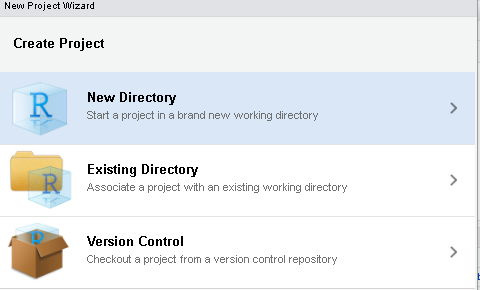
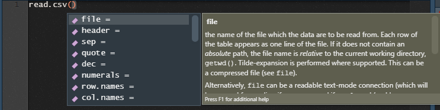

<style type="text/css">

.remark-slide-content {
    font-size: 25px;
    padding: 1em 1em 1em 1em;
}

```{css, eval = TRUE, echo = FALSE}

.remark-code{
  line-height: 1.5; font-size: 80%
}

@media print {
  .has-continuation {
    display: block;
  }
}
```


```{r xaringan-scribble, echo=FALSE}
##~~~~~~~~~~~~~~~~~~~~~~~~~~~~~~~~~~~~~~~~~~~~~~~~~~~~~~~~~~~~~~~~~~~~~~~~~~~~~~
##                                  PIZARRA                                 ----
##~~~~~~~~~~~~~~~~~~~~~~~~~~~~~~~~~~~~~~~~~~~~~~~~~~~~~~~~~~~~~~~~~~~~~~~~~~~~~~
xaringanExtra::use_scribble()
```


```{r xaringanExtra-clipboard, echo=FALSE}
##~~~~~~~~~~~~~~~~~~~~~~~~~~~~~~~~~~~~~~~~~~~~~~~~~~~~~~~~~~~~~~~~~~~~~~~~~~~~~~
##                                  cLIPBOARD                               ----
##~~~~~~~~~~~~~~~~~~~~~~~~~~~~~~~~~~~~~~~~~~~~~~~~~~~~~~~~~~~~~~~~~~~~~~~~~~~~~~
htmltools::tagList(
  xaringanExtra::use_clipboard(
    button_text = "<i class=\"fa fa-Copiar código\"></i>",
    success_text = "<i class=\"fa fa-check\" style=\"color: #90BE6D\"></i>",
    error_text = "<i class=\"fa fa-times-circle\" style=\"color: #F94144\"></i>"
  ),
  rmarkdown::html_dependency_font_awesome()
)
```


```{r xaringan-fit-screen, echo=FALSE}
##~~~~~~~~~~~~~~~~~~~~~~~~~~~~~~~~~~~~~~~~~~~~~~~~~~~~~~~~~~~~~~~~~~~~~~~~~~~~~~
##                          PRESENTACION VS RSTUDIO                         ----
##~~~~~~~~~~~~~~~~~~~~~~~~~~~~~~~~~~~~~~~~~~~~~~~~~~~~~~~~~~~~~~~~~~~~~~~~~~~~~~
xaringanExtra::use_fit_screen()
```


```{r xaringan-extra-styles, echo = FALSE}
##~~~~~~~~~~~~~~~~~~~~~~~~~~~~~~~~~~~~~~~~~~~~~~~~~~~~~~~~~~~~~~~~~~~~~~~~~~~~~~
##                          ESTILOS EXTRA -RESALTADO-                       ----
##~~~~~~~~~~~~~~~~~~~~~~~~~~~~~~~~~~~~~~~~~~~~~~~~~~~~~~~~~~~~~~~~~~~~~~~~~~~~~~
xaringanExtra::use_extra_styles(
  hover_code_line = TRUE,         #<<
  mute_unhighlighted_code = TRUE  #<<
)
```

```{r, include = F}

library(flipbookr)
library(tidyverse)
library(openxlsx)
library(xaringanthemer)
library(xaringan)
library(gt)
library(icons)
library(here)
library(kableExtra)

options(scipen = 999)

```


# Hoja de ruta

## ✔️ Proyectos en R

## ✔️ Nombrando archivos

## ✔️ Mirada exploratoria de la base

## ✔️ Uniendo dataframes

## ✔️ Exportación de resultados


<br>

Algunas referencias que inspiran este material:    

https://es.r4ds.hadley.nz/flujo-de-trabajo-proyectos.html   
https://slides.djnavarro.net/project-structure/   


---

class: inverse, center, middle

# Directorios de trabajo

<html>
  <div style='float:left'></div>
  <hr color='#EB811B' size=1px width=1125px>
</html>

---

#Directorios de trabajo - Proyectos
¿Cómo garantizar que la ruta para importar bases de datos al ambiente de R y para exportar resultados pueda funcionar si muevo mis carpetas o las comparto?

.left-column[

```{r echo=FALSE, eval=TRUE}

```
]

.right-column[
```{r echo=TRUE, eval=FALSE}
read.csv("C:\Users\Guido\Clase 4\bases\inmuebles-estado-nacional.csv")
```

```{r echo=TRUE, eval=FALSE}
dir.create("C:\Users\Guido\Clase 4\Resultados")
```

```{r echo=TRUE, eval=FALSE}
setwd("C:\Users\Guido\Cursos\Diplomatura UNSAM\")
```

```{r echo=FALSE, eval=TRUE,fig.align='left'}
knitr::include_graphics("img/Rproject.png")
```
]   

---
#Directorios de trabajo - Proyectos
.pull-left[Rstudio tiene una herramienta muy útil de trabajo, que son los  **proyectos**. Un proyecto es un archivo que identifica toda una carpeta de trabajo. Para crearlo, vamos al logo de nuevo proyecto y elegimos la carpeta de trabajo. Cuando trabajemos con proyectos: 

-   El directorio de trabajo siempre toma como punto inicial la carpeta donde esta ubicada el archivo .Rproj. 
-   El Environment es específico de nuestro proyecto. No se nos mezclará con resultados de código que podamos correr en otros proyectos.
]
.pull-right[
```{r echo=FALSE, warning=TRUE}
knitr::include_graphics("img/nuevo_proyecto.png")
```
```{r echo=FALSE, warning=TRUE}

```
]

---
#Práctica  

- Abran RStudio en sus computadoras y creen un nuevo proyecto en una carpeta de sus computadoras que este a mano.     

- Abran un nuevo script, importen las librerías **"openxlsx"** y **"tidyverse"** al ambiente de trabajo. Instalenlas previamente en caso de no haberlo hecho aún. Recuerden: `install.packages("nombre_del_paquete")`

- Guarden el script dentro de la carpeta del proyecto que crearon.   

- Ejecuten la función `list.files()`     

---

class: inverse, center, middle

# Nombrando archivos

<html>
  <div style='float:left'></div>
  <hr color='#EB811B' size=1px width=1125px>
</html>

---

#Nombrando Archivos 

##Serie de recomendaciones para organizar la carpeta de trabajo de un proyecto 
- Preferentemente utilizar minúsculas para nombrar nuestros archivos 

✅  procesamiento.r  
❌  Procesamiento.r   
✅  analisis.r   

- No utilizar espacios en blanco ni caracteres especiales (^.*?+|$) 

✅  procesamiento_inmuebles.r  
❌  procesamiento inmuebles.r
❌  procesamiento.inmuebles.r     
✅  graficos_evolucion_inmuebles.r  
❌  gráficos_evolución_inmuebles.r  

---
#Nombrando archivos (y/o carpetas)
  
  - Guardar consistencia en los caracteres utilizados y el orden de los componentes de los nombres

✅  procesamiento_inmuebles.r   
✅  graficos_evolucion_inmuebles.r  
❌  inmuebles-informe.rmd  

- Si tengo muchos archivos en una carpeta: utilizar números para ordenar y palabras clave para documentos similares  

✅  01_procesamiento_base_inmuebles.r  
✅  02_graficos_evolucion_inmuebles.r  
✅  03_graficos_provincias_inmuebles.r  
✅  04_informe_inmuebles.r  
❌  inmuebles-datos-VF20210414.r  


---


class: inverse, center, middle

# Importación de archivos (repaso)

<html>
  <div style='float:left'></div>
    <hr color='#EB811B' size=1px width=1125px>
      </html>
      
---
#Importación de bases de datos
A la hora de importar una base de datos nos podemos llegar a enfrentar a distintos tipos de archivos. En R contamos con **distintos paquetes y funciones** según el **tipo de extensión** del archivo:    

```{r echo=FALSE}
importacion <- tibble(
  "Tipo de archivo" = c("Texto Plano",
                        "Texto Plano",
                        "Texto Plano",
                        "Extension de R",
                        "Extension de R",
                         "Otros Softwares",
                         "Otros Softwares",
                         "Excel",
                         "Excel"),
           "Paquete" =c("readr",
                        "readr",
                        "readr",
                        "RBase",
                        "RBase",
                        "haven",
                        "haven",
                        "openxlsx",
                        "readxl"),
             "Extension" =c(".csv",
                          ".txt",
                          ".tsv",
                          ".RDS",
                          ".RDATA",
                          ".dta",
                          ".sav",
                          ".xlsx",
                          ".xls"),
         "Funciones" = c("read_csv()",
                           "read_txt()","read_tsv()",
                           "readRDS()", "open()",
                           "read_dta()","read_spss()",
                           "read.xlsx()","read_excel()")    
)  

kable(importacion, format = 'html') %>%
  kable_styling(bootstrap_options = c("striped", "hover")) %>% 
  collapse_rows(columns = 2)
```


---
#Importación de bases de datos

## Archivos de texto plano
.pull-left[
En archivos de texto plano, se recomienda usar el paquete **readr** (que forma parte de tidyverse). Las diferencias entre cada una de sus funciones está en los parámetros que poseen para mejorar la importación.

```{r echo=FALSE, warning=TRUE}

```
]
.pull-right[
¿Qué es lo que indican algunos de los parámetros que tenemos en la imagen?

-   encabezado (¿Tiene o no una primera fila con los nombes de las variables?)
-   delimitador (¿Cómo están separadas las variables en el archivo?: Ej: `,`, `;`, tab)
-   separador decimal (¿Cómo figuran los números en la base? Ej: ¿10.000, 10000 o 10,000)
-   quotes: ¿Como están indicados los valores de las variables de texto en la base?, ¿Aparecen entre comillas?
]

---
#Importación de bases de datos (usando proyectos)

Si tenemos abierto un proyecto, el punto de partida para la ruta a especificar será la carpeta del proyecto. Si queremos ir hacia atrás en las carpetas agregamos  **`../`**
```{r eval=T, message=FALSE, warning=FALSE, comment=FALSE, include=T}

inmuebles<- read_csv(
  file = "bases/inmuebles-estado-nacional.csv")  

comunas <- read.xlsx(xlsxFile = "bases/comunas.xlsx")
```
**IMPORTANTE**: Siempre que lean bases de datos asignarlas a un nuevo objeto. De lo contrario, las va a mostrar completas en consola y no va a guardarlas en el ambiente de trabajo (enviroment)       


---
#Práctica

- Copien la carpeta "bases" adentro de la carpeta del proyecto que crearon previamente.

- Con el proyecto y script previos abiertos en RStudio, importen correctamente a su ambiente de trabajo el archivo **"inmuebles-estado-nacional.csv"**

- Utilicen la función `read.xlsx` para importar como dos objetos separados las bases que se encuentran en ambas pestañas del excel **"comunas.xlsx"**. (Pista: Pueden inspeccionar los parámetros de la función ejecutando **`?read.xlsx`**  

---
#Mirada exploratoria de la base de datos
Algunas funciones útiles para explorar rápidamente el contenido de nuestra base de datos:
- **`summary()`**: Muestra medidas de resumen de las variables: distintos momentos de la distribución para variables *numéricas* o de *fecha*, y un conteo de casos para variables de tipo *character*. 

- **`unique()`**: Permite ver los únicos valores que toma cierta variable en mi base de datos.

- **`table()`**: Esta función puede utilizarse para hacer tabulados univariados o bivariados.

- **`glimpse()`**<sup>t</sup>: nos muestra en formato más amigable un listado de las variables de la base, indicando la clase de variable en cuestión, y muestra los primeros valores de cada una de ellas

- **`sample_n()`**<sup>t</sup>: Nos permite seleccionar una muestra al azar de **n** casos de nuestra base. Puede ser útil para una primera mirada de la base que trascienda a los primeros casos, o bien para procedimienos de muestreo.  

<sup>t</sup> Pertenecen al paquete **tidyverse**

---

```{r summary, include=FALSE}
inmuebles %>% #BREAK
  summary() #BREAK
```

`r chunk_reveal("summary", widths = c(1.1, 1.9), title = "# Ejemplo - summary()")`

---

```{r glimpse, include=FALSE}
inmuebles %>% #BREAK
  glimpse()#BREAK
```

`r chunk_reveal("glimpse", widths = c(1.1, 1.9), title = "# Ejemplo - glimpse()")`

---

```{r sample, include=FALSE}
inmuebles %>% #BREAK
  sample_n(size = 10)#BREAK
```

`r chunk_reveal("sample", widths = c(1.1, 1.9), title = "# Ejemplo - sample_n()")`

---
#Práctica
- Importen la base de datos al ambiente de trabajo (Ver función adecuada para importar archivos .RDS)
- Apliquen la función **`summary(nombre_base_datos)`**. Observen el resultado en consola. ¿Algo les llama atención de la información arrojada?
- Ejecuten **`table(inmuebles$pais)`** y observen el total de casos de la base por provincia
- Elaboren un tabulado bivariado entre las variables **pais** y **situacion_inmueble**
- ¿Qué valores puedo encontrar en la variable **organizacion**?

---

class: inverse, center, middle

# Uniendo dataframes

<html>
  <div style='float:left'></div>
  <hr color='#EB811B' size=1px width=1125px>
</html>

---
# Uniendo dataframes - dplyr (dentro de tidyverse)

.pull-left[
**Joins**: Nos permiten unir horizontalmente dos bases, a partir de alguna/s variable/s en común   

```{r echo=FALSE, warning=TRUE}
knitr::include_graphics("img/joins2.png",dpi = 200)
```
[Fuente](https://www.youtube.com/watch?v=Yg-pNqzDuN4)

]
.pull-right[
**bind_rows()**: Nos permiten unir verticalmente dos bases, apilando los valores de aquellas variables en común 

```{r echo=FALSE, warning=TRUE}
knitr::include_graphics("img/bind_rows.png",dpi = 200)
```

[Fuente](https://blog.exploratory.io/merging-two-data-frames-with-union-or-bind-rows-a55e79766d0?gi=dbebe4a50052)

]

---
# Uniendo dataframes - dplyr (dentro de tidyverse)    
**left_join**: Veamos como funciona si tengo estos dos dataframes (el de la izquierda seria mi base de datos y el de la derecha un diccionario de como esta codificado el nivel educativo)
```{r,eval=TRUE,include=F}
base_encuesta <- data.frame(
  sexo = sample(x = 1:2,size = 15,replace = T),
  edad = sample(x = 1:99,size = 15,replace = T),
  nivel_ed = sample(x = 1:7,size = 15,replace = T))

diccionario_niveles <- data.frame(nivel_ed = 1:7,
                                  nivel_ed_text = c(
                                    "Primaria incompleta",
                                    "Primaria completa",
                                    "Secundaria incompleta",
                                    "Secundaria completa",
                                    "Terc/Univ incompleta",
                                    "Terc/Univ completa",
                                    "Sin Instruccion")) 

diccionario_niveles_posgrad <- data.frame(
  nivel_ed = 8:9,
  nivel_ed_text = c("Posgrado incompleto",
                    "Posgrado completo"))
```

.pull-left[

```{r}
base_encuesta
```
]
.pull-right[
```{r}

diccionario_niveles
```
]

---

```{r leftjoin, include=FALSE}
base_encuesta %>%  #BREAK
  left_join(.,diccionario_niveles)

```

`r chunk_reveal("leftjoin", widths = c(1.1, 1.9), title = "# Ejemplo - left_join()")`

---

class: inverse, center, middle

# Exportacion de Resultados

<html>
  <div style='float:left'></div>
  <hr color='#EB811B' size=1px width=1125px>
</html>

---

#Exportación de resultados
Por lo general, cada paquete que presenta funciones para importar bases de datos, tiene como complemento una función para exportar (guardar en el disco de nuestra PC) un objeto con la misma extensión. Ejemplos: 


 - el paquete **openxlsx** tiene una función denominada **`write.xlsx()`** que nos permite exportar un dataframe creando un archivo **.xslx**
 - En RBase la función **`saveRDS()`** nos permite exportar archivos de extensión **.RDS** (son menos pesados para trabajarlos luego desde R)

En general estas funciones tienen un primer parametro para especificar el objeto a exportar, y un segundo para especificar la ruta y el nombre de archivo a crear () 
```{r eval=FALSE, include=T}
write.xlsx(x = objeto_resultados,file = "Resultados/cuadro1.xlsx")

saveRDS(object = objeto_resultados,file = "Resultados/base_nueva.RDS")
```

---
#Práctica
- Importen todas las bases de datos de la carpeta **bases** a su ambiente de trabajo

- Usen la función bind_rows() para unir la base **inmuebles-estado-nacional.csv** con la base **otros-inmuebles-estado-nacional.csv**

- Prueben correr las funciones unique() y duplicated() sobre el resultado anterior. Luego, en caso de haber, eliminen los registros duplicados 

- Observen los valores que toma la variable `COMUNAS` en el listado que presenta el archivo **Comunas.xlsx**.Creen  una nueva columna llamada "localidad" que les sirva para unir la informacion con la de la base de los inmuebles 

- Usen la función left_join() para incorporar a la base de inmuebles la informacion de los barrios que tiene cada comuna

---
#Práctica
- Ejecuten ```dir.create("Resultados/")```. ¿Que generó en la carpeta de su proyecto?

- Exporten el objeto que contiene la base final hacia un Excel utilizando la funcion **`write.xlsx`**.   