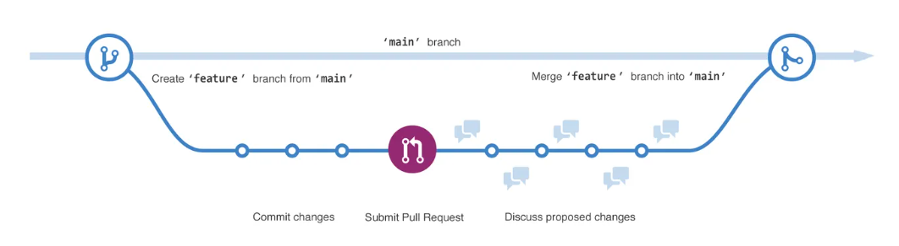

```{r setup, include=FALSE}
library(tufte)
# invalidate cache when the tufte version changes
knitr::opts_chunk$set(cache.extra = packageVersion('tufte'))
options(htmltools.dir.version = FALSE)
```


# ¿Por qué Github?

[GitHub](https://github.com/) es una plataforma diseñada para **almacenar y administrar código**, al mismo tiempo nos permite llevar un *registro* y *control* de cualquier **cambio** sobre este código. 

Es una de las herramientas fundamentales para la **colaboración** y el **trabajo en equipo**.

Tener un registro de todos los cambios (y la posibilidad de deshacerlos!) se vuelve más importante a medida que nos dedicamos a proyectos más complejos y colaboramos con equipos más grandes. GitHub nos permite almacenar información sobre qué cambios se hicieron, cuándo, quién los hizo y por qué se hicieron.


# Dinámica de trabajo

La estructura básica para trabajar con GitHub son los **repositorios**:

*Un repositorio o proyecto de Git comprende toda la colección de archivos y carpetas asociados con un proyecto, en conjunto con el historial de revisión de cada archivo.*

El **flujo básico de trabajo** en GitHub es el siguiente:

1. Crear/clonar un repositorio.

2. Agregar/modificar código localmente.

3. Enviar nuestras modificaciones al repositorio (en la nube).

4. Descargar a nuestro repositorio local las modificaciones de nuestro equipo.

5. Hacer modificaciones nuevas y enviarlas a GitHub.

6. Repetir infinitamente 4 y 5.

A diferencia de otros softwares de control de versiones (Google Drive, Dropbox, etc.), está especialmente diseñado para trabajar cómodamente con código, y permite formas de colaboración más complejas: básicamente, no sólo hacer una modificación, sino proponer caminos alternativos.

{width="800"}


# Cómo interactuar con GitHub?

Hay muchas [opciones](https://docs.github.com/es/get-started/onboarding/getting-started-with-your-github-account#3-elegir-c%C3%B3mo-interactuar-con-github) para interactuar con GitHub, comentamos algunas:

-   [GitHub Desktop](https://docs.github.com/es/desktop/installing-and-configuring-github-desktop/overview/getting-started-with-github-desktop)

-   [Visual Studio Code](https://code.visualstudio.com/) 

-   [Rstudio + Git](https://happygitwithr.com/rstudio-git-github.html)

# Algunos recursos

[¿Cómo crear una cuenta?](https://docs.github.com/es/get-started/onboarding/getting-started-with-your-github-account) 

[Una guía con ejemplos para empezar a usar Git](https://github.com/git-guides)

[Principales comandos](https://git-scm.com/docs):

-   **git clone** clona el repositorio, es decir, nos permite descargar a nuestro directorio local un repositorio.

-   **git status** muestra nuestra situación: el estado de los cambios locales, en qué rama estamos, etc.

-   **git pull** actualiza la línea de desarrollo local con actualizaciones de sus contrapartes remotas. Es decir, descargar a nuestro repositorio local las modificaciones de nuestro equipo.

-   **git add** + **git commit** + **git push** nos permiten enviar nuestros cambios locales al repositorio.

    -   git add es el primer paso, que agrega archivos nuevos o modificados en el directorio local de trabajo al área de *staging* de Git.

    -   git commit -m "bla bla bla estuve haciendo el cmabio x, y , z" guarda nuestros cambios al historial de versiones. Todo lo que se haya almacenado provisionalmente con git add pasará a formar parte del historial. Con este comando incluimos el mensaje explicando los cambios que hicimos.

    -   git push envía nuestros cambios y así actualiza el repositorio remoto con las modificaciones (ya commiteadas) realizadas localmente.

Un poco más avanzado:

-   **git branch** muestra las ramas en las que se trabaja localmente.

-   **git merge** combina las líneas de desarrollo. Este comando habitualmente se utiliza para combinar los cambios que se realizan en dos ramas distintas. Por ejemplo, un desarrollador podría hacer una fusión cuando necesite combinar los cambios de una rama de característica en la rama de desarrollo principal.


