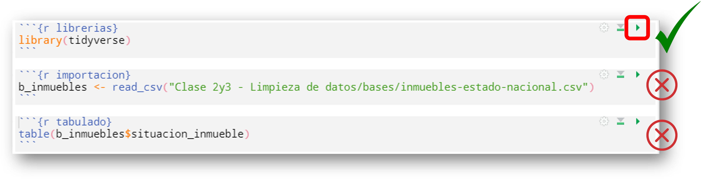

<style type="text/css">

.remark-slide-content {
    font-size: 25px;
    padding: 1em 1em 1em 1em;
}

```{css, eval = TRUE, echo = FALSE}

.remark-code{
  line-height: 1.5; font-size: 80%
}

@media print {
  .has-continuation {
    display: block;
  }
}
```


```{r xaringan-scribble, echo=FALSE}
##~~~~~~~~~~~~~~~~~~~~~~~~~~~~~~~~~~~~~~~~~~~~~~~~~~~~~~~~~~~~~~~~~~~~~~~~~~~~~~
##                                  PIZARRA                                 ----
##~~~~~~~~~~~~~~~~~~~~~~~~~~~~~~~~~~~~~~~~~~~~~~~~~~~~~~~~~~~~~~~~~~~~~~~~~~~~~~
xaringanExtra::use_scribble()
```


```{r xaringanExtra-clipboard, echo=FALSE}
##~~~~~~~~~~~~~~~~~~~~~~~~~~~~~~~~~~~~~~~~~~~~~~~~~~~~~~~~~~~~~~~~~~~~~~~~~~~~~~
##                                  cLIPBOARD                               ----
##~~~~~~~~~~~~~~~~~~~~~~~~~~~~~~~~~~~~~~~~~~~~~~~~~~~~~~~~~~~~~~~~~~~~~~~~~~~~~~
htmltools::tagList(
  xaringanExtra::use_clipboard(
    button_text = "<i class=\"fa fa-Copiar código\"></i>",
    success_text = "<i class=\"fa fa-check\" style=\"color: #90BE6D\"></i>",
    error_text = "<i class=\"fa fa-times-circle\" style=\"color: #F94144\"></i>"
  ),
  rmarkdown::html_dependency_font_awesome()
)
```


```{r xaringan-fit-screen, echo=FALSE}
##~~~~~~~~~~~~~~~~~~~~~~~~~~~~~~~~~~~~~~~~~~~~~~~~~~~~~~~~~~~~~~~~~~~~~~~~~~~~~~
##                          PRESENTACION VS RSTUDIO                         ----
##~~~~~~~~~~~~~~~~~~~~~~~~~~~~~~~~~~~~~~~~~~~~~~~~~~~~~~~~~~~~~~~~~~~~~~~~~~~~~~
xaringanExtra::use_fit_screen()
```


```{r xaringan-extra-styles, echo = FALSE}
##~~~~~~~~~~~~~~~~~~~~~~~~~~~~~~~~~~~~~~~~~~~~~~~~~~~~~~~~~~~~~~~~~~~~~~~~~~~~~~
##                          ESTILOS EXTRA -RESALTADO-                       ----
##~~~~~~~~~~~~~~~~~~~~~~~~~~~~~~~~~~~~~~~~~~~~~~~~~~~~~~~~~~~~~~~~~~~~~~~~~~~~~~
xaringanExtra::use_extra_styles(
  hover_code_line = TRUE,         #<<
  mute_unhighlighted_code = TRUE  #<<
)
```

```{r, include = F}

library(flipbookr)
library(tidyverse)
library(openxlsx)
library(xaringanthemer)
library(xaringan)
library(gt)
library(icons)
library(here)
library(kableExtra)

options(scipen = 999)

```


# Hoja de ruta

## ✔️ ¿Qué es Rmarkdown (_spoiler: R + Mardown_)?

## ✔️ Conceptos básicos de Markdown

## ✔️ YAML, Chunks y texto


<br>

Algunas referencias que inspiran este material:    

- https://swcarpentry.github.io/r-novice-gapminder-es/15-knitr-markdown/index.html 

- https://shilaan-apa.netlify.app/


---
# Flujo de Trabajo de las CSCyHD

```{r echo=FALSE, eval=TRUE, out.width='75%', fig.align='center'}
knitr::include_graphics("img/circuito_del_dato_tidy.png")
```

---
class: inverse, center, middle

# Rmarkdown

<html>
  <div style='float:left'></div>
  <hr color='#EB811B' size=1px width=1125px>
</html>

---
# R + Markdown

## Rmarkdown es un formato de Rstudio que permite combinar la **sintaxis de Markdown** para escritura de texto plano con la **sintáxis de R** para el procesamiento de datos.

```{r echo=FALSE, eval=TRUE, out.width='65%', fig.align='center'}

```

---
# Hasta ahora...


```{r echo=FALSE, eval=TRUE, out.width='35%', fig.align='center'}
knitr::include_graphics("img/informe_0.jpg")
```

---
# Hasta ahora...


```{r echo=FALSE, eval=TRUE, out.width='35%', fig.align='center'}

```

---
# Hasta ahora...


```{r echo=FALSE, eval=TRUE, out.width='35%', fig.align='center'}

```

---
# Hasta ahora...


```{r echo=FALSE, eval=TRUE, out.width='45%', fig.align='center'}

```

---
# Hasta ahora...


```{r echo=FALSE, eval=TRUE, out.width='45%', fig.align='center'}

```

---
# Hasta ahora...

.pull-left[

```{r echo=FALSE, eval=TRUE, out.width='100%', fig.align='center'}

```

]

--

.pull-right[

```{r echo=FALSE, eval=TRUE, out.width='100%', fig.align='center'}

```

]

---
# Desventajas del "hasta ahora..."

<br>

- ## Decenas, cientos, miles de versiones. `informe_FINAL_FINAL_FINAL_V2_1.doc`

- ## I-rreproducible

- ## ¿Mismo informe con nuevos datos?: "no de nuevo"[1](https://www.youtube.com/watch?v=SOBNO4gl_yM)

---
class: middle, center, inverse
  

```{r echo=FALSE, out.width = '30%', fig.align = 'center'}
knitr::include_graphics("img/logo_rmarkdown.png")
```

---
# Rmarkdown

.pull-left[

## Antes:
```{r echo=FALSE, out.width = '110%', fig.align = 'center'}

```

]

.pull-right[

## Después:
```{r echo=FALSE, out.width = '110%', fig.align = 'center'}

```
  
]

---
# Rmarkdown - Formatos de salida


```{r echo=FALSE, out.width = '50%', fig.align = 'center'}

```

---
# Rmarkdown - Nuevo archivo


```{r echo=FALSE, out.width = '85%', fig.align = 'center'}

```

---
# Rmarkdown - Componentes


```{r echo=FALSE, out.width = '80%', fig.align = 'center'}

```


---
class: inverse, middle, center


# _ENCABEZADO (YAML)_


<html>
  <div style='float:left'></div>
  <hr color='#EB811B' size=1px width=1125px>
</html>
---
# Rmarkdown - YAML (metadata o encabezado)

<br><br>

```{r echo=FALSE, out.width = '100%', fig.align = 'center'}

```

---
class: inverse, middle, center


# _CODIGO_


<html>
  <div style='float:left'></div>
  <hr color='#EB811B' size=1px width=1125px>
</html>
 
---
# Rmarkdown - chunk (o bloque de código) - Estructura

```{r echo=FALSE, out.width = '100%', fig.align = 'center'}

```


---
# Rmarkdown - chunk (o bloque de código) - Estructura

```{r echo=FALSE, out.width = '90%', fig.align = 'center'}

```

--

```{r echo=FALSE, out.width = '90%', fig.align = 'center'}

```

--

```{r echo=FALSE, out.width = '90%', fig.align = 'center'}

```


---
# Rmarkdown - chunk (o bloque de código) - Estructura

```{r echo=FALSE, out.width = '100%', fig.align = 'center'}

```

---
# Rmarkdown - chunk (o bloque de código)-Configuración


```{r eval=FALSE, include=FALSE}

```


| __Función__                     | __Acción__ |
| :---                            | :---       |
| `{r echo = FALSE}`              | *Muestra sólo resultado del chunk*|
| `{r echo = TRUE}`               | *Muestra código y resultado del chunk*|
| `{r eval = FALSE}`              | *Muestra código pero no ejecuta*|
| `{r include = FALSE}`           | *No muestra nada (ni código ni resultado) pero ejecuta código*|
| `{r eval = FALSE, include = FALSE}` | *No muestra nada (ni código ni resultado) tampoco ejecuta*|


---
# Rmarkdown - chunk (o bloque de código) - Ejecución


```{r echo=FALSE, out.width = '75%', fig.align = 'center'}

```

--

```{r echo=FALSE, out.width = '75%', fig.align = 'center'}

```


---
# Rmarkdown - chunk (o bloque de código) - Índice


```{r echo=FALSE, out.width = '75%', fig.align = 'center'}

```

---
class: inverse, middle, center


# _TEXTO_


<html>
  <div style='float:left'></div>
  <hr color='#EB811B' size=1px width=1125px>
</html>


---
# Rmarkdown - Texto


```{r echo=FALSE, out.width = '100%', fig.align = 'center'}

```

---
# Rmarkdown - Código en texto

```{r echo=FALSE, out.width = '100%', fig.align = 'center'}

```

---
class: inverse, middle, center


# _PRÁCTICA_


<html>
  <div style='float:left'></div>
  <hr color='#EB811B' size=1px width=1125px>
</html>
 


---
class: inverse, middle

# Práctica


1) Crear un informe que contenga:

- **En TEXTO:**
  - Una estructura mínima de texto (Título, consigna, descripción de las tareas realizadas y muy breve conclusión)

- **En CÓDIGO:**
  - Carga de librerías (no mostrar el código en el reporte)
  - Importación de datos (mostrar el código en el reporte)
  - Algún procesamiento mínimo como filtrar, seleccionar, generar un tabulado, etc. (mostrar el código y el resultado en el reporte)

- _Extra_: Incluir un gráfico

---
# RECURSOS

- [Guía de comandos para texto en Rmarkdown](https://www.rstudio.com/wp-content/uploads/2015/03/rmarkdown-reference.pdf?_ga=2.157796986.1542626288.1625161001-1806201684.1624641897)

- [Guía definitiva de Rmarkdown (en inglés)](https://bookdown.org/yihui/rmarkdown/)

- [Machete Rmarkdown](https://raw.githubusercontent.com/rstudio/cheatsheets/main/rmarkdown.pdf)

- [Cocina de Rmarkdown (en inglés)](https://bookdown.org/yihui/rmarkdown-cookbook/)